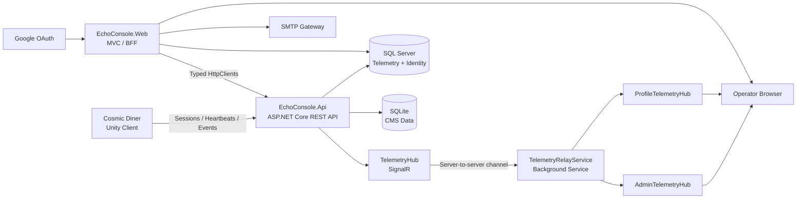

<div align="center">

# 🌌 ECHO CONSOLE

### `COSMIC DINER // TELEMETRY & SECURITY STATION`

**Plataforma web de telemetría, identidad y operaciones en tiempo real para el universo retrofuturista de *Cosmic Diner*.**

<br>

[](https://github.com/Juliomm8/EchoConsole)
[](https://github.com/Juliomm8/EchoConsole)
[](https://dotnet.microsoft.com/)
[](https://learn.microsoft.com/aspnet/core/)
[](https://learn.microsoft.com/aspnet/core/signalr/)
[](https://tailwindcss.com/)
[](https://www.microsoft.com/sql-server)
[](https://unity.com/)

<br>

> **Cuando *Cosmic Diner* transmite desde la oscuridad, Echo Console escucha.**

</div>

```text
╔══════════════════════════════════════════════════════════╗
║ DARK SKY STUDIOS // DEEP SPACE OPERATIONS NETWORK       ║
╠══════════════════════════════════════════════════════════╣
║ SYSTEM........... ECHO CONSOLE                           ║
║ BUILD............ 0.9.0                                  ║
║ TELEMETRY........ ONLINE                                 ║
║ SECURITY CHANNEL. ENCRYPTED                              ║
║ OPERATOR LINK.... ESTABLISHED                            ║
╚══════════════════════════════════════════════════════════╝
```

---

## 📡 ¿Qué es Echo Console?

**Echo Console** es la estación central de operaciones de **Dark Sky Studios** para *Cosmic Diner*, un videojuego de terror retrofuturista ambientado en un restaurante perdido entre transmisiones espaciales, tecnología analógica y sistemas que nunca debieron volver a encenderse.

La plataforma conecta el videojuego con una infraestructura web capaz de:

* Supervisar sesiones activas en tiempo real.
* Procesar eventos y heartbeats enviados por el juego.
* Administrar instalaciones, builds, alertas y operadores.
* Proteger identidades mediante autenticación moderna.
* Gestionar preferencias, dispositivos y sesiones de acceso.
* Presentar toda la información mediante una interfaz CRT inspirada en terminales de los años 80.

No es únicamente un panel administrativo. Es la **capa operativa, de seguridad y observabilidad** del universo de *Cosmic Diner*.

---

## 🛰️ Vista del sistema

### Guest Terminal


### Administration Station


### Player Dossier


---

## ⚡ Capacidades principales

### 1. Live Player Dashboard

El **Dashboard del Jugador** funciona como un dossier operativo conectado directamente con la actividad de *Cosmic Diner*.

Incluye:

* Estado de conexión `ONLINE`, `DEGRADED` u `OFFLINE`.
* Heartbeat visual con indicador de pulsación en tiempo real.
* Sesión activa y tiempo transcurrido.
* Escena, fase y estado actual del juego.
* Tiempo total jugado.
* Número total de sesiones.
* Build utilizada con mayor frecuencia.
* Última actividad registrada.
* Tendencia SVG de actividad durante los últimos siete días.
* Registro de los últimos eventos recibidos.

```text
> EVENT_LOG

17:20:04  Enemy Encounter started
17:18:32  Kitchen Sector entered
17:16:09  Power grid restored
17:14:47  Session heartbeat received
17:12:01  Operator connected
```

La actualización utiliza **SignalR** como canal principal y un sistema de reconciliación por polling como respaldo, evitando recargas completas de la página y reduciendo consultas innecesarias.

#### Eventos transmitidos

| Evento                 | Propósito                                    |
| ---------------------- | -------------------------------------------- |
| `sessionStarted`       | Inicio de una nueva sesión del juego         |
| `sessionHeartbeat`     | Confirmación periódica de conexión           |
| `sessionEventRecorded` | Evento de gameplay o telemetría              |
| `sessionEnded`         | Cierre normal de una sesión                  |
| `sessionExpired`       | Sesión marcada como inactiva por el servidor |

---

### 2. Telemetry Relay Network

Echo Console utiliza una arquitectura de relay para aislar correctamente los diferentes canales de información.

* La API recibe telemetría desde el cliente del juego.
* `TelemetryHub` distribuye eventos internos.
* `TelemetryRelayService` mantiene una conexión persistente con la API.
* `AdminTelemetryHub` transmite información global al panel administrativo.
* `ProfileTelemetryHub` entrega únicamente los eventos pertenecientes al jugador autenticado.
* Cada operador se conecta a un grupo privado identificado por su `UserId`.

Esto evita enviar información de todos los jugadores a todos los clientes y mantiene una separación segura entre telemetría administrativa y personal.

---

### 3. Player Settings Command Center

La página de ajustes utiliza una arquitectura **Single-Page Scroll** con navegación por anclas y actualización asíncrona.

#### `[ IDENTIDAD ]`

* Edición de alias del operador.
* Selector visual de seis avatares retro.
* Preferencias persistentes por usuario.
* Idioma preferido en inglés o español.
* Temas globales de terminal CRT.

#### Temas disponibles

| Tema             | Descripción                          |
| ---------------- | ------------------------------------ |
| `Phosphor Green` | Monitor verde clásico de terminal    |
| `Burned Amber`   | Fósforo ámbar tenue y analógico      |
| `Cold Cyan`      | Terminal científica de tonos cian    |
| `Monochrome`     | Estación de control en escala neutra |

#### `[ SEGURIDAD ]`

* Cambio seguro de contraseña.
* Validación mediante ASP.NET Core Identity.
* Visualización de sesiones activas.
* Identificación de navegador, sistema y dispositivo.
* Revocación de sesiones individuales.
* Cierre de todas las demás sesiones.
* Notificación por correo después de modificar credenciales.

#### `[ DISPOSITIVOS ]`

* Vinculación de instalaciones.
* Verificación de hardware.
* Identificación de nodos asociados.
* Desvinculación segura de dispositivos.

#### `[ DANGER ZONE ]`

* Eliminación permanente de perfil.
* Verificación adicional de contraseña.
* Frase de confirmación obligatoria.
* Doble confirmación visual.

---

### 4. Security Overhaul

La seguridad de Echo Console utiliza un modelo de **defensa en profundidad** distribuido entre Identity, cookies seguras, validación de correo, límites de peticiones y aislamiento de servicios.

#### Autenticación híbrida

* Credenciales locales mediante ASP.NET Core Identity.
* Inicio de sesión con Google OAuth.
* Vinculación de identidad externa.
* Confirmación obligatoria de correo.
* Cookies `HttpOnly`.
* Política `SameSite`.
* Cookies seguras en producción.
* Renovación controlada de sesiones.
* Validación periódica del Security Stamp.

#### Verificación OTP

* Secuencia de seis dígitos.
* Generación criptográficamente segura.
* Expiración después de cinco minutos.
* Reenvío de secuencia.
* Cuenta regresiva sincronizada con el servidor.
* Comparación resistente a diferencias de tiempo.
* Envío real mediante SMTP.

#### Recuperación de contraseña

* Respuesta genérica contra enumeración de usuarios.
* Tokens oficiales de ASP.NET Core Identity.
* Enlaces de restablecimiento codificados de forma segura.
* Expiración controlada del token.
* Revocación de sesiones después del cambio.
* Alerta automática al correo del operador.

#### Rate Limiting

Los endpoints sensibles de autenticación utilizan una política de ventana fija:

```text
POLICY........ FixedWindow_Auth
WINDOW........ 1 minute
PERMIT LIMIT.. 5 requests per IP
QUEUE......... disabled
REJECTION..... HTTP 429 Too Many Requests
```

La API dispone además de políticas separadas para la ingesta de telemetría y eventos de sesión.

#### Seguridad servidor a servidor

La comunicación entre `EchoConsole.Web` y `EchoConsole.Api` está protegida mediante:

* API Key administrativa.
* `AdminApiKeyHandler`.
* Políticas de autorización dedicadas.
* Comparación criptográfica en tiempo constante.
* Clientes HTTP tipados.
* Separación entre endpoints públicos, administrativos y del juego.

---

### 5. SMTP Security Channel

Los mensajes de correo no son notificaciones genéricas: forman parte de la experiencia narrativa de Echo Console.

El servicio SMTP genera mensajes HTML con estética terminal para:

* Verificación OTP.
* Recuperación de contraseña.
* Confirmación de cambio de credenciales.
* Alertas de seguridad.

```text
[ECHO CONSOLE] SECURITY NOTICE: PASSWORD ALTERED

OPERATOR STATUS....... VERIFIED
CREDENTIAL UPDATE..... COMPLETED
TIMESTAMP............. UTC
SECURITY CHANNEL...... ACTIVE
```

Las plantillas se adaptan al idioma preferido del usuario.

---

### 6. Builds and Release Control

El módulo de builds administra las versiones desplegadas de *Cosmic Diner*.

* Número de versión.
* Versión de Unity.
* Notas de lanzamiento.
* Estado de publicación.
* Historial de versiones.
* Búsqueda y paginación.
* Asociación entre sesiones y builds.

---

### 7. Installations and Hardware Inventory

Cada instalación del juego puede registrarse como un nodo independiente.

La plataforma almacena y supervisa:

* Installation ID.
* Sistema operativo.
* CPU.
* GPU.
* Memoria RAM.
* Nombre del dispositivo.
* Último contacto.
* Propietario vinculado.
* Estado operativo.

---

### 8. Alerts and Live Operations

Echo Console integra herramientas para operaciones internas y supervisión de incidentes.

* Alertas del sistema.
* Estados y severidades.
* Live Operations.
* Simulación de eventos.
* Expiración automática de sesiones inactivas.
* Envío opcional de alertas mediante Discord Webhooks.
* Patch notes y contenido operativo.
* Paneles administrativos en tiempo real.

---

### 9. Localization and Accessibility

Toda la plataforma está preparada para operar en:

* English — `en`
* Español — `es`

La cultura preferida se almacena:

1. En el perfil del usuario.
2. En la cookie de localización de ASP.NET Core.
3. En los recursos `SharedResource.resx`.
4. En los mensajes de interfaz y correos de seguridad.

La UI incluye además:

* Regiones `aria-live`.
* Estados de foco visibles.
* Navegación por teclado.
* Etiquetas descriptivas.
* Formularios con validaciones localizadas.
* Soporte para reducción de movimiento.

---

## 🏗️ Arquitectura

Echo Console utiliza una arquitectura desacoplada compuesta por una API, una aplicación MVC y canales de comunicación en tiempo real.



### Flujo de telemetría

```text
UNITY CLIENT
    │
    ├── starts session
    ├── sends heartbeat
    ├── reports scene and phase
    ├── records gameplay event
    └── closes session
            │
            ▼
ECHO CONSOLE API
            │
            ├── validates request
            ├── applies rate limits
            ├── persists telemetry
            └── publishes SignalR event
                    │
                    ▼
TELEMETRY RELAY
            │
            ├── Admin channel
            └── Private player channel
                    │
                    ▼
LIVE WEB DASHBOARD
```

---

## 🧰 Tech Stack

### Backend

| Tecnología              | Uso                                |
| ----------------------- | ---------------------------------- |
| C#                      | Lenguaje principal                 |
| .NET 8                  | Runtime de la solución             |
| ASP.NET Core MVC        | Aplicación web y Razor Views       |
| ASP.NET Core Web API    | API REST                           |
| ASP.NET Core Identity   | Usuarios, credenciales y tokens    |
| ASP.NET Core SignalR    | Comunicación en tiempo real        |
| Entity Framework Core 8 | Acceso a datos                     |
| SQL Server              | Telemetría, sesiones e identidad   |
| SQLite                  | Datos auxiliares de CMS            |
| Background Services     | Relay, presencia y alertas         |
| Swagger / OpenAPI       | Exploración y documentación de API |

### Frontend

| Tecnología            | Uso                                    |
| --------------------- | -------------------------------------- |
| Razor Views           | Renderizado del servidor               |
| Tailwind CSS 3.4      | Sistema visual responsivo              |
| Vanilla JavaScript    | Interacciones sin dependencias pesadas |
| CSS Custom Properties | Temas CRT persistentes                 |
| SVG dinámico          | Tendencias de actividad                |
| SignalR Client        | Actualización inmediata del dashboard  |

### Integraciones

| Integración      | Propósito                                  |
| ---------------- | ------------------------------------------ |
| Google OAuth     | Inicio de sesión externo                   |
| SMTP             | OTP, recuperación y alertas                |
| Discord Webhooks | Alertas operativas                         |
| Unity            | Emisión de telemetría desde *Cosmic Diner* |

---

## 📁 Estructura del repositorio

```text
EchoConsole/
├── EchoConsole.Api/
│   ├── BackgroundServices/
│   │   ├── SessionPresenceWorker.cs
│   │   └── DiscordAlertDispatcher.cs
│   ├── Configuration/
│   ├── Contracts/
│   ├── Controllers/
│   │   ├── Admin/
│   │   ├── Client/
│   │   └── Profile/
│   ├── Domain/
│   │   ├── Entities/
│   │   └── Enums/
│   ├── Hubs/
│   │   └── TelemetryHub.cs
│   ├── Persistence/
│   │   ├── Migrations/
│   │   └── EchoConsoleDbContext.cs
│   ├── Security/
│   ├── Services/
│   └── Program.cs
│
├── EchoConsole.Web/
│   ├── BackgroundServices/
│   │   └── TelemetryRelayService.cs
│   ├── Controllers/
│   ├── Hubs/
│   │   ├── AdminTelemetryHub.cs
│   │   └── ProfileTelemetryHub.cs
│   ├── Models/
│   ├── Resources/
│   │   ├── SharedResource.resx
│   │   └── SharedResource.es.resx
│   ├── Security/
│   ├── Services/
│   │   ├── Accounts/
│   │   ├── Api/
│   │   └── Profile/
│   ├── Views/
│   ├── wwwroot/
│   │   ├── css/
│   │   ├── images/
│   │   └── js/
│   ├── package.json
│   └── Program.cs
│
├── EchoConsole.sln
└── README.md
```

---

## 🚀 Ejecución local

### Requisitos

* .NET 8 SDK
* SQL Server o SQL Server LocalDB
* Node.js 18 o superior
* npm
* Visual Studio 2022, Rider o VS Code
* Credenciales SMTP para probar correos
* Credenciales Google OAuth para autenticación externa

### 1. Clonar el repositorio

```bash
git clone https://github.com/Juliomm8/EchoConsole.git
cd EchoConsole
```

### 2. Restaurar dependencias .NET

```bash
dotnet restore EchoConsole.sln
```

### 3. Instalar y compilar Tailwind CSS

```bash
cd EchoConsole.Web
npm install
npm run build:css
cd ..
```

Para recompilar automáticamente durante el desarrollo:

```bash
cd EchoConsole.Web
npm run watch:css
```

### 4. Configurar la API

```bash
cd EchoConsole.Api

dotnet user-secrets set "ConnectionStrings:DefaultConnection" "Server=YOUR_SERVER;Database=EchoConsole;Trusted_Connection=True;TrustServerCertificate=True"
dotnet user-secrets set "ConnectionStrings:CmsConnection" "Data Source=echo-console-cms.db"

dotnet user-secrets set "AdminApiSecurity:ApiKey" "YOUR_LONG_RANDOM_API_KEY"

dotnet user-secrets set "Cors:AllowedOrigins:0" "https://localhost:YOUR_WEB_PORT"

dotnet user-secrets set "DiscordAlerts:Enabled" "false"
dotnet user-secrets set "DiscordAlerts:WebhookUrl" ""
```

### 5. Configurar la aplicación Web

```bash
cd ../EchoConsole.Web

dotnet user-secrets set "ConnectionStrings:DefaultConnection" "Server=YOUR_SERVER;Database=EchoConsole;Trusted_Connection=True;TrustServerCertificate=True"

dotnet user-secrets set "ApiSettings:BaseUrl" "https://localhost:YOUR_API_PORT"
dotnet user-secrets set "AdminApiSecurity:ApiKey" "YOUR_LONG_RANDOM_API_KEY"

dotnet user-secrets set "Authentication:Google:ClientId" "YOUR_GOOGLE_CLIENT_ID"
dotnet user-secrets set "Authentication:Google:ClientSecret" "YOUR_GOOGLE_CLIENT_SECRET"

dotnet user-secrets set "Smtp:Host" "smtp.your-provider.com"
dotnet user-secrets set "Smtp:Port" "587"
dotnet user-secrets set "Smtp:Username" "your-account@example.com"
dotnet user-secrets set "Smtp:Password" "YOUR_SMTP_APP_PASSWORD"
dotnet user-secrets set "Smtp:FromEmail" "your-account@example.com"
dotnet user-secrets set "Smtp:FromName" "Echo Console"
dotnet user-secrets set "Smtp:EnableSsl" "true"
```

> Nunca publiques API Keys, contraseñas SMTP, cadenas de conexión o secretos OAuth dentro del repositorio.

### 6. Aplicar migraciones

Desde la raíz de la solución:

```bash
dotnet ef database update \
  --project EchoConsole.Api \
  --startup-project EchoConsole.Api \
  --context EchoConsoleDbContext
```

### 7. Iniciar los servicios

Terminal 1:

```bash
dotnet run --project EchoConsole.Api
```

Terminal 2:

```bash
dotnet run --project EchoConsole.Web
```

También puedes configurar Visual Studio para iniciar ambos proyectos simultáneamente.

---

## 🔧 Variables de configuración

### EchoConsole.Api

| Clave                                 | Descripción                  |
| ------------------------------------- | ---------------------------- |
| `ConnectionStrings:DefaultConnection` | Base de datos principal      |
| `ConnectionStrings:CmsConnection`     | Base de datos SQLite del CMS |
| `AdminApiSecurity:ApiKey`             | Comunicación administrativa  |
| `Cors:AllowedOrigins`                 | Orígenes permitidos          |
| `DiscordAlerts:Enabled`               | Habilita el dispatcher       |
| `DiscordAlerts:WebhookUrl`            | Webhook de Discord           |
| `DiscordAlerts:PollIntervalSeconds`   | Intervalo de procesamiento   |
| `DiscordAlerts:BatchSize`             | Alertas procesadas por lote  |

### EchoConsole.Web

| Clave                                 | Descripción                  |
| ------------------------------------- | ---------------------------- |
| `ConnectionStrings:DefaultConnection` | Identity y datos compartidos |
| `ApiSettings:BaseUrl`                 | Dirección de EchoConsole.Api |
| `AdminApiSecurity:ApiKey`             | API Key compartida           |
| `Authentication:Google:ClientId`      | Cliente OAuth                |
| `Authentication:Google:ClientSecret`  | Secreto OAuth                |
| `Smtp:Host`                           | Servidor SMTP                |
| `Smtp:Port`                           | Puerto SMTP                  |
| `Smtp:Username`                       | Usuario SMTP                 |
| `Smtp:Password`                       | Contraseña o App Password    |
| `Smtp:FromEmail`                      | Remitente                    |
| `Smtp:FromName`                       | Nombre visible               |
| `Smtp:EnableSsl`                      | Habilita TLS/SSL             |

---

## 🧪 Comandos útiles

Compilar toda la solución:

```bash
dotnet build EchoConsole.sln
```

Ejecutar pruebas, cuando estén disponibles:

```bash
dotnet test EchoConsole.sln
```

Limpiar artefactos:

```bash
dotnet clean EchoConsole.sln
```

Generar CSS de producción:

```bash
cd EchoConsole.Web
npm run build:css
```

Crear una migración:

```bash
dotnet ef migrations add MigrationName \
  --project EchoConsole.Api \
  --startup-project EchoConsole.Api \
  --context EchoConsoleDbContext
```

---

## 🌿 Flujo de desarrollo

El proyecto sigue una estrategia de ramas orientada a entregas Agile.

```text
main
└── epic/sprint-module
    ├── feature/new-capability
    ├── task/implementation-detail
    └── fix/critical-correction
```

Ejemplos:

```text
epic/s9-profile-overhaul
feature/live-player-dashboard
feature/security-overhaul
fix/password-visibility
```

Antes de abrir un Pull Request:

```bash
dotnet build EchoConsole.sln
npm run build:css --prefix EchoConsole.Web
```

Checklist recomendado:

* La solución compila.
* No existen secretos en archivos versionados.
* Las migraciones son reproducibles.
* Los textos nuevos existen en inglés y español.
* Los endpoints sensibles requieren autorización.
* Los cambios visuales son responsivos.
* Los eventos SignalR no filtran datos entre usuarios.
* Las lecturas de EF Core utilizan `AsNoTracking()` cuando corresponde.

---

## 🗺️ Roadmap

### Próximas Integraciones del Estudio

Echo Console será el punto de acceso para nuevas herramientas nativas creadas por **Dark Sky Studios**.

#### 1. Normal Map Generator

Aplicación para convertir texturas base en mapas de normales ajustables para el pipeline visual de *Cosmic Diner*.

```text
STATUS: PLANNED
MODULE: DARK SKY ASSET LAB
```

#### 2. File Converter

Herramienta unificada para convertir archivos de arte, audio, datos y recursos de producción.

```text
STATUS: PLANNED
MODULE: FORMAT TRANSFER STATION
```

#### 3. ZIP Auto-Patcher

Sistema nativo para validar, respaldar y aplicar paquetes de actualización sobre builds del estudio.

```text
STATUS: PLANNED
MODULE: AUTOMATED PATCH NETWORK
```

---

## 👨‍🚀 Equipo

### Dark Sky Studios

**Desarrollo e ingeniería**

* **Julio Mera**
* **Jeremy Arturo Tomaselly Ríos**

**Proyecto asociado**

* *Cosmic Diner*
* Unity 2022.3 LTS
* Retro-futuristic horror experience

---

## 📜 Estado del proyecto

Echo Console se encuentra actualmente en desarrollo activo.

La versión `0.9.0` representa una etapa previa a la consolidación del pipeline de producción, despliegue y lanzamiento público.

```text
> SYSTEM MESSAGE

Echo Console is not a decorative dashboard.
It is the operational memory of Cosmic Diner.

Every heartbeat is stored.
Every session leaves an echo.
```

---

<div align="center">

### `DARK SKY STUDIOS // THE SIGNAL IS STILL ALIVE`

**Built for *Cosmic Diner*. Powered by .NET. Connected through Echo Console.**

[Repository](https://github.com/Juliomm8/EchoConsole) · [Issues](https://github.com/Juliomm8/EchoConsole/issues) · [Pull Requests](https://github.com/Juliomm8/EchoConsole/pulls)

</div>
